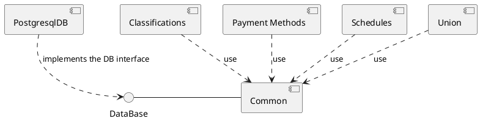

This project is created based on the "Payroll" case study from the [Agile Software Development Principles And Patterns](https://www.goodreads.com/book/show/84985.Agile_Software_Development_Principles_Patterns_and_Practices) by [Robert.C.Martin](https://en.wikipedia.org/wiki/Robert_C._Martin).

---

The architecture
=
The simple payroll system uses a Domain Model to cover its's Business functionality.
Beside there are Operations which create/update the Domain Model Entities.

The files are organized by business concepts:
 - classification
 - payment_methods
 - schedules
 - union
 - common
 
Each business concept contains:
 - the entities
 - the operations
 - it's tests.

Other component is the Relational Database Persistence component which uses the repository pattern provided by the [ROM-rb](https://rom-rb.org) to persist the Objects from the Domain.
It also contains an array/"in memory" implementation of the Persistence Layer.

---

---

The code loader is ["Zeitwerk"](https://github.com/fxn/zeitwerk "Zeitwerk") using ["Conventional File Structure"](https://github.com/fxn/zeitwerk#file-structure).
 
---

Use Cases:
=
  1. Add a new employee (with 3 classifications: salaried/hourly/comissioned)
  2. Delete an employee
  3. Post a time card for salaried employee
  4. Post a sales receipt for comissioned employee
  5. Post a union service charge
  6. Change employee details
  7. Run the payroll for today

---

Use Case Descriptions
--

Use Case 1: Add new Employee
-
A new employee is added by the receipt of an AddEmp Transaction. This
Transaction contains the employee's name, address, and assigned
employee number. The transaction has three forms:

1. AddEmp <emp_id> "<name>" "<address>" H <hrly-rate>
2. AddEmp <emp_id> "<name>" "<address>" S <mtly-slry>
3. AddEmp <emp_id> "<name>" "<address>" C <mtly-slry> <com-rate>

The employee record is created with its fields assigned appropriately.

Alternative 1: An error in the transaction structure

If the transaction structure is inappropriate, it is printed out in an
error message, and no action is taken

Use Case 2: Deleting an Employee
-
Employees are deleted when a DelEmp transaction is received. The form
of this transaction is as follows:

DelEmp <emp_id>

When this transaction is received, trhe appropriate employee record is deleted.

Alternative 1: Invalid or unknown emp_id

If the <emp_id> field is not structured correctly or does not refer to
a valid employee record, the transaction is pinted with an error
message, and no other action is taken.

Use Case 3: Post a Time Card
-
On receipt of a TimeCard transaction, the system will create a time
card record an associate it with the appropriate employee record.

TimeCard <emp_id> <date> <hours>

Alternative 1: The selected employee is not hourly

The system will print an appropriate error message and take no further action.

Alternative 2: An error in the transaction structure

The system will print an appropriate error message and take no further action.

Use Case 4: Post a Sales Receipt
-
On receipt of the SalesReceipt Transaction, the system will create a
new salesreceipt record and associate it with the appropriate
commissioned employee.

SalesReceipt <emp_id> <date> <amount>

Alternative 1: The selected employee not commissioned

The system will print an appropriate error message and take no further action.

Alternative 2: An error in the transaction structure

The system will print an appropriate error message and take no further action.

Use Case 5: Post a Union Service Charge
-
On receipt of this transaction, the system will create a
service-charge record and associate it with the appropriate union
member.

ServiceCharge <member_id> <amount>

Alternative 1: Poorly formed transaction

If the transaction is not well formed or if the <member_id> does not
refer to an existing union member, the transaction is printed with an
appropriate error message.

Use Case 6: Changing Employee Details
-
Upon receipt of this transaction, the system will alter one of the
details of the appropriate employee record. There are several possible
variations to this transaction.

 - ChgEmp <emp_id> Name <name>                      Change employee name
 - ChgEmp <emp_id> Address <address>                Change employee address
 - ChgEmp <emp_id> Hourly <hourly-rate>             Change to hourly
 - ChgEmp <emp_id> Salaried <salary>                Change to salaried
 - ChgEmp <emp_id> Commissioned <salary> <rate>     Change to commissioned
 - ChgEmp <emp_id> Member <member_id> Dues <rate>    Put employee in union
 - ChgEmp <emp_id> NoMember                         Cut employee from union

Alternative 1: Transaction errors

If the structure of the transaction is improper, <emp_id> does not
refer to a real employee, or <member_id> alreday refers to a member,
the system will print a suitable error and take no further action.

Use Case 7: Run the Payroll for today
-
On receipt of the payday transaction, the system finds all those
employees that should be paid on the specified date. The system then
determines how much they are owed and pays them according to ther
selected payment method. An audit-trail report is printed showing the
action taken for each employee.

Payday <date>
