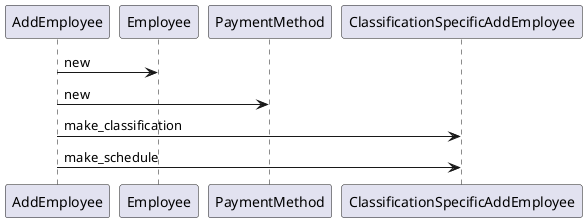

```puml
@startuml
AddEmployee -> Employee: new
AddEmployee -> PaymentMethod: new
AddEmployee -> ClassificationSpecificAddEmployee: make_classification
AddEmployee -> ClassificationSpecificAddEmployee: make_schedule
@enduml
```
