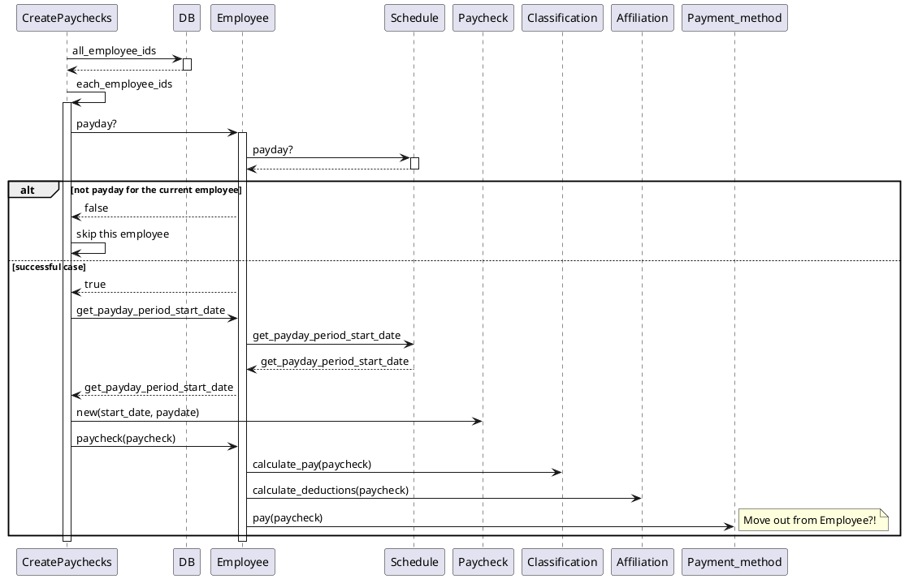

```puml
@startuml
CreatePaychecks -> DB: all_employee_ids
activate DB
return
deactivate DB

CreatePaychecks -> CreatePaychecks: each_employee_ids
activate CreatePaychecks

CreatePaychecks -> Employee: payday?
activate Employee
Employee -> Schedule: payday?
activate Schedule
return
deactivate Schedule

alt not payday for the current employee
    Employee --> CreatePaychecks: false
    CreatePaychecks -> CreatePaychecks: skip this employee

else successful case 
    Employee --> CreatePaychecks: true
    CreatePaychecks -> Employee: get_payday_period_start_date
    Employee -> Schedule: get_payday_period_start_date
    Schedule --> Employee: get_payday_period_start_date
    Employee --> CreatePaychecks: get_payday_period_start_date

    CreatePaychecks -> Paycheck: new(start_date, paydate)
    CreatePaychecks -> Employee: paycheck(paycheck)
    Employee -> Classification: calculate_pay(paycheck)
    Employee -> Affiliation: calculate_deductions(paycheck)
    Employee -> Payment_method: pay(paycheck)
    note right : Move out from Employee?! 
end
deactivate Employee

deactivate CreatePaychecks
@enduml
```
