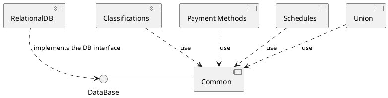

```puml
@startuml

DataBase -[Common]
[Common] as Common
[Classifications] as classifications
classifications ..> Common : use
[Payment Methods] ..> Common : use
[Schedules] ..> Common : use
[Union] ..> Common : use
[RelationalDB] ..> DataBase: implements the DB interface

@enduml

```
