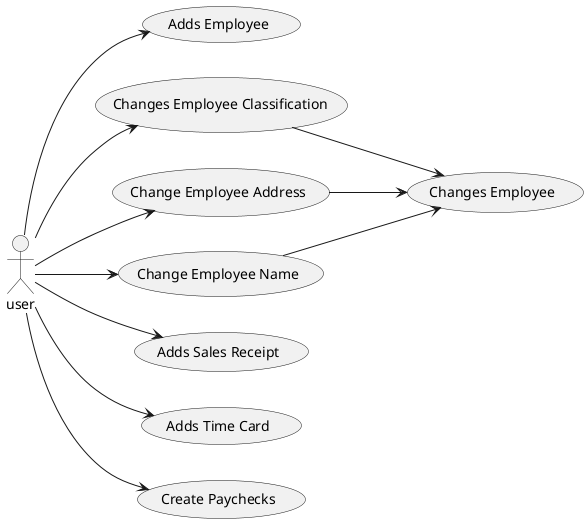

```puml
@startuml

left to right direction
user --> (Adds Employee)
user --> (Changes Employee Classification)
user --> (Change Employee Address)
user --> (Change Employee Name)
user --> (Adds Sales Receipt)
user --> (Adds Time Card)
user --> (Create Paychecks)

left to right direction
(Changes Employee Classification) --> (Changes Employee) 
(Change Employee Address) --> (Changes Employee)
(Change Employee Name) --> (Changes Employee)

@enduml
```
